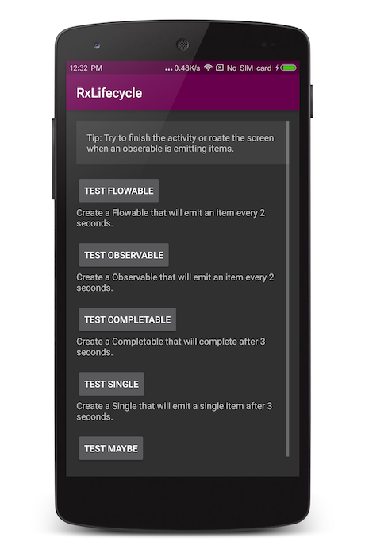

# rxlifecycle (non-invasive)
[](http://www.apache.org/licenses/LICENSE-2.0.html) [](https://jitpack.io/#nekocode/rxlifecycle)

This library is a **non-invasive** version of [RxLifecycle](https://github.com/trello/RxLifecycle). It can help you to automatically complete the observable sequences based on `Activity` or `Fragment`'s lifecycle.

**Supports only RxJava 2 now.**

## Usage

Use the `Transformer`s provided. `bind(your activity or fragment).with(observable type)`.

```
RxLifecycle.bind(activity).withFlowable()
RxLifecycle.bind(activity).withObservable()
RxLifecycle.bind(activity).withCompletable()
RxLifecycle.bind(activity).withSingle()
RxLifecycle.bind(activity).withMaybe()
```

And then compose it to your original observable.

```
Observable.interval(0, 2, TimeUnit.SECONDS)
        .compose(RxLifecycle.bind(MainActivity.this).<Long>withObservable())
        .subscribeOn(Schedulers.computation())
        .observeOn(AndroidSchedulers.mainThread())
        .subscribe(new Consumer<Long>() {
            @Override
            public void accept(Long n) throws Exception {
                toast("Observable -> " + n.toString());
            }
        });
```

**That's all. You needn't to extend your activity or fragment.**

You can also observe the lifecycle events by using the `.asFlowable()` or `.asObservable()` methods to convert the `RxLifecycle` to a `Flowable` or `Observable`.

```
RxLifecycle.bind(this)
        .asFlowable()
        .subscribe(new Consumer<Integer>() {
            @Override
            public void accept(@LifecyclePublisher.Event Integer event) throws Exception {
                switch (event) {
                    case LifecyclePublisher.ON_START:
                        toast("Your activity is started.");
                        break;

                    case LifecyclePublisher.ON_STOP:
                        toast("Your activity is stopped.");
                        break;
                }
            }
        });
```

In addition, you can also bind observables to the `FragmentManager` or [`LifecyclePublisher`](rxlifecycle/src/main/java/cn/nekocode/rxlifecycle/LifecyclePublisher.java).

## Sample

Check out the [sample](sample/src/main/java/cn/nekocode/rxlifecycle/sample/MainActivity.java) for more detail.



## Using with gradle
- Add the JitPack repository to your `build.gradle` repositories:

```gradle
repositories {
    // ...
    maven { url "https://jitpack.io" }
}
```

- Add the core dependency:

```
dependencies {
    compile 'com.github.nekocode.rxlifecycle:rxlifecycle:{lastest-version}'
}
```

- (Optional) Add the below library if you need to support api 9 and later. Besides, if you already add support-v4 dependency, I will also suggest you to use this compact library, and then use the `RxLifecycleCompact` instead of the `RxLifecycle`.

```
dependencies {
    compile 'com.github.nekocode.rxlifecycle:rxlifecycle-compact:{lastest-version}'
}
```
